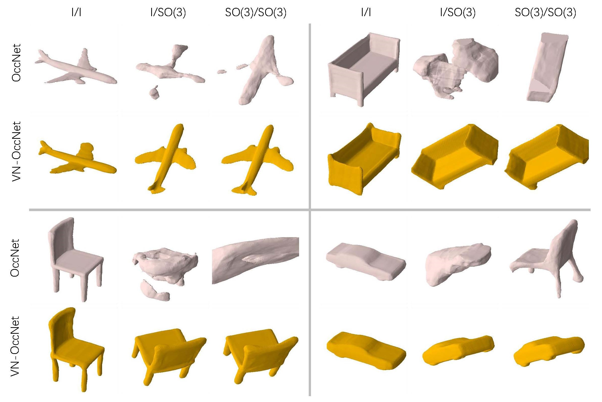

# Neural Implicit Reconstruction with Vector Neurons

This repository contains code for the neural implicit reconstruction experiments in the paper
[Vector Neurons: A General Framework for SO(3)-Equivariant Networks](https://arxiv.org/pdf/2104.12229.pdf). Code for classification and segmentation experiments can be found [here](https://github.com/FlyingGiraffe/vnn/).



[[Project]](https://cs.stanford.edu/~congyue/vnn/) [[Paper]](https://arxiv.org/pdf/2104.12229.pdf)

## Preparation
The code structure follows [Occupancy Networks](https://github.com/autonomousvision/occupancy_networks). Please follow their instructions to prepare the data and install the dependencies. Run
```
python generate_random_rotation.py
```
to precompute the random rotations for all input pointclouds.

## Usage

To train and evaluate the networks, please run these two commands
```
python train.py CONFIG.yaml
python eval.py CONFIG.yaml
```

The configuration files are, for VN-OccNet,
```
configs/equinet/vnn_pointnet_resnet_resnet_ROTATION.yaml
```
for the vanilla OccNet baseline,
```
configs/pointcloud/onet_resnet_ROTATION.yaml
```
and for vanilla PointNet encoder + invariant decoder,
```
configs/equinet/inner_baseline_resnet_ROTATION.yaml
```

`ROTATION` can be chosen from `aligned` (no rotations) and `so3` (with precomputed random rotations). We also provide two settings `rot-rand` (generate random rotations on the fly during training) and `pca` (apply PCA pre-alignment the the input pointclouds), which are not reported in the paper.

## Citation
Please cite this paper if you want to use it in your work,

    @article{deng2021vn,
      title={Vector Neurons: a general framework for SO(3)-equivariant networks},
      author={Deng, Congyue and Litany, Or and Duan, Yueqi and Poulenard, Adrien and Tagliasacchi, Andrea and Guibas, Leonidas},
      journal={arXiv preprint arXiv:2104.12229},
      year={2021}
    }

## License
MIT License

## Acknowledgement
The structure of this codebase is borrowed from [Occupancy Networks](https://github.com/autonomousvision/occupancy_networks).
